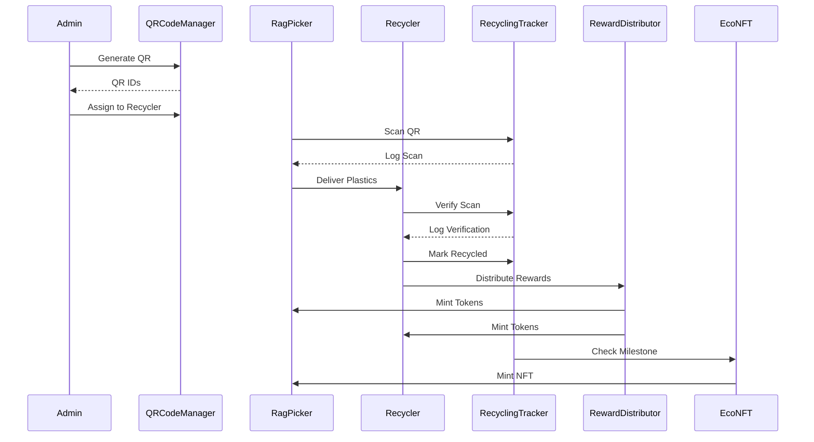
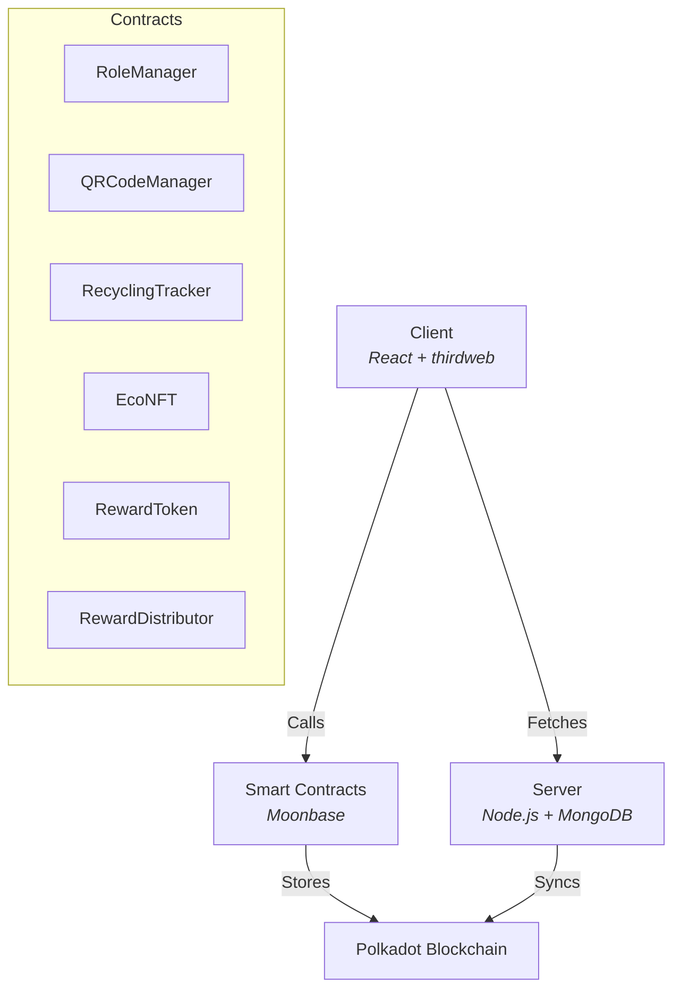

# ♻️ Plastic Waste Trace & Reward System

> Empowering communities to recycle, trace, and get rewarded—leveraging blockchain, QR codes, and gamification for real-world sustainability!

## [Project Overview](#project-overview)

**Plastic Waste Trace & Reward System** is a blockchain-powered platform designed to bring transparency, accountability, and real incentives to plastic recycling. By leveraging unique QR codes and smart contracts on **Polkadot parachain Moonbase**, the platform ensures every piece of plastic collected can be traced, verified, and rewarded. The core mission is to motivate effective community action, support rag pickers and recyclers, and provide cities with auditable recycling data in an open and secure environment.

### Problem

Plastic pollution is a major environmental challenge with serious urban impact:

- Inefficient collection and tracking of recyclables.
- Lack of trustworthy data on recycling rates and sources.
- Unrecognized efforts of frontline collectors (rag pickers and recyclers).
- Low community engagement due to lack of transparency and incentives.

### Solution

Our platform delivers:

- **Unique QR codes** that physically and digitally track plastic throughout the collection and recycling lifecycle.
- **Immutable blockchain records** on Moonbase for all actions (scan, verify, recycle), ensuring tamper-proof histories and accurate impact reporting.
- **Automated, tokenized eco-rewards** for rag pickers and recyclers to incentivize consistent participation.
- **Gamified dashboards and leaderboards** that enhance engagement and community pride.
- **Open dashboards** for citizens and city officials to monitor and celebrate recycling progress.

### Key Features

- Immutable tracking on Polkadot Moonbase
- Token and NFT rewards
- Public dashboards for citizens
- Fraud-proof QR lifecycle

## [Tech Stack](#tech-stack)

- **Blockchain:** Moonbase EVM-compatible Layer 2 — core smart contracts and trusted event logging.
- **Smart Contracts:**
  - RoleManager (permission control)
  - QRCodeManager (QR code generation and assignment)
  - RecyclingTracker (lifecycle event tracking)
  - RewardToken (ERC-20 eco-rewards)
  - RewardDistributor (automated payouts)
- **Frontend:** React.js with **thirdweb SDK** for fast wallet connections, contract interaction, and seamless user onboarding.
- **Backend:** Node.js + Express + MongoDB for fast analytics, dashboards, and session management.
- **Web3 Tools:** thirdweb (wallet and contracts), Ethers.js.
- **Development:** Hardhat (compile, test, deploy), OpenZeppelin (security best practices).

### 🏆 Sponsor Tech Highlights

### Moonbase (by Polkadot)

- All critical smart contracts and immutable event logs run on **Moonbase's** Layer 2 blockchain, capitalizing on ultra-low fees and sub-second confirmation times.
- Full EVM compatibility lets us write and deploy Solidity contracts using familiar tooling like Hardhat and OpenZeppelin—enabling rapid, reliable development.
- Sustainability-aligned, Moonbase uses an energy-efficient proof mechanism, keeping your environmental footprint minimal.

### Thirdweb

- **User Authentication** & Wallet Management: Simplifies sign-in flows across all roles with React hooks (`ConnectWallet`) and secure wallet integrations.
- **Contract Interaction:** Handles blockchain calls like QR scan logging and reward disbursement using the thirdweb React SDK, abstracting the complexities of Ethers.js.
- **Token Management:** Our RewardToken derives from thirdweb's audited ERC-20 implementation, ensuring upgradability and compatibility.
- **Admin Tools:** Includes easy-to-use dashboards and proxy upgrade support for secure contract upgrades and role management.
- **Developer Friendly:** Tools for fast local testing, gas estimation, and deployment to Moonbase testnets/mainnet with an optimized developer experience.

### User Flow



### Flow Summary

1. **Admin:**

   - Generates unique QR codes and assigns them to recyclers or collection points.
   - Approves recyclers/rag pickers and manages reward pools.
   - Monitors overall recycling progress via dashboards.

2. **Recycler:**

   - Receives and distributes QR codes.
   - Verifies collected plastics scanned by rag pickers.
   - Marks items as recycled to trigger rewards.

3. **Rag Picker:**

   - Scans QR codes on collected plastic waste.
   - Submits collection data on the mobile/web dApp.
   - Earns eco-reward tokens for verified activities.

4. **Citizen/Public:**
   - Observes community recycling efforts, leaderboards, and campaign impact.
   - Engages by sharing and supporting eco-champions.

## [System Architecture](#system-architecture)

### On-Chain

- **Smart Contracts (Solidity):** Manage roles, QR lifecycle, recycling events, and reward distribution.
- **Immutable Event Logs:** Every scan, verify, and recycle action is recorded with timestamps.
- **Access Control:** RoleManager enforces restricted permissions for security.
- **Reward Logic:** RewardDistributor contract automates payouts based on verified events.

### Off-Chain Backend & Analytics

- **MongoDB:** Stores user profiles, session data, and derived analytics (for fast dashboards).
- **Express API:** Serves frontend requests for dashboards, leaderboards, and admin controls.
- **Event Listeners:** Sync blockchain events to the DB for realtime UX.

### Frontend (React + thirdweb)

- **Wallet Connection and Transactions:** Facilitated by thirdweb React SDK, ensuring easy and secure blockchain interactions.
- **Mobile-First QR Scanning:** Uses device cameras and browser APIs for simple, fast scan-and-submit flows.
- **Role-Specific Dashboards:** Tailored views for Admin, Recycler, Rag Picker, and Citizen roles.
- **Admin Console:** Manages user onboarding, QR code generation, and reward pool funding.



## Installation and Setup

### Prerequisites

- Node.js (v14+)
- Yarn or npm
- Hardhat
- MongoDB
- MetaMask

### Clone

```bash
git clone https://github.com/your-repo.git
cd your-repo
```

### Contracts

```bash
cd contracts
yarn install
npx hardhat compile
npx hardhat run scripts/deploy.js --network moonbase
```

### Server

```bash
cd ../server
yarn install
yarn start
```

### Client

```bash
cd ../client
yarn install
yarn start
```

## Contribute and Collaborate

Contributions, ideas, and feedback are welcome!

- Fork the repo
- Open issues or pull requests
- Join the discussion on community channels

## License

MIT License

## Let’s build a cleaner, greener future—together! 🌱✨

_Questions or feedback? Open an issue or DM the maintainer._
